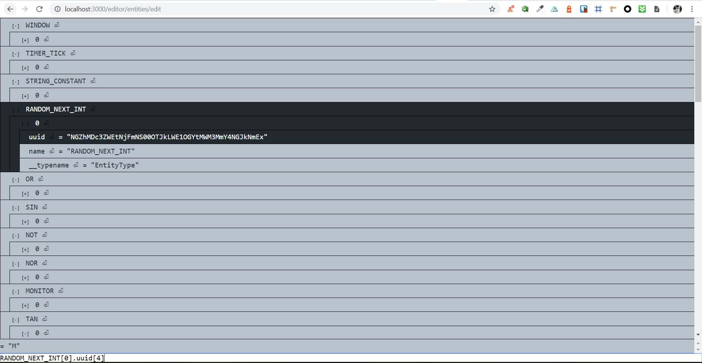
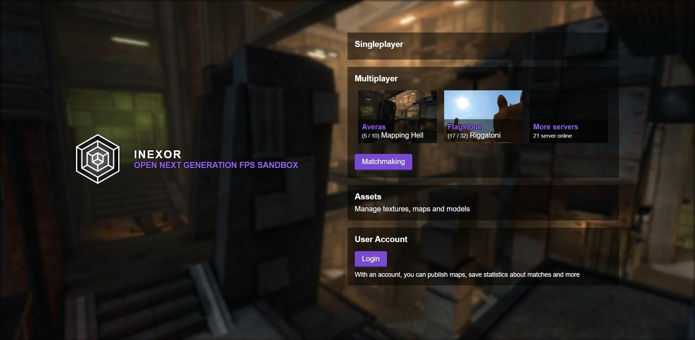
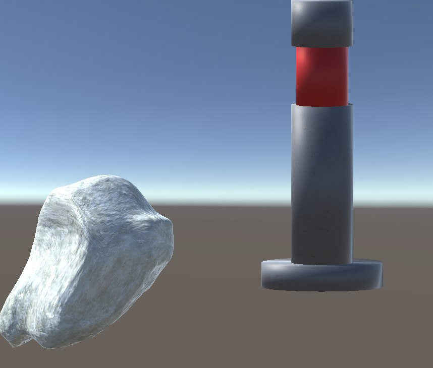
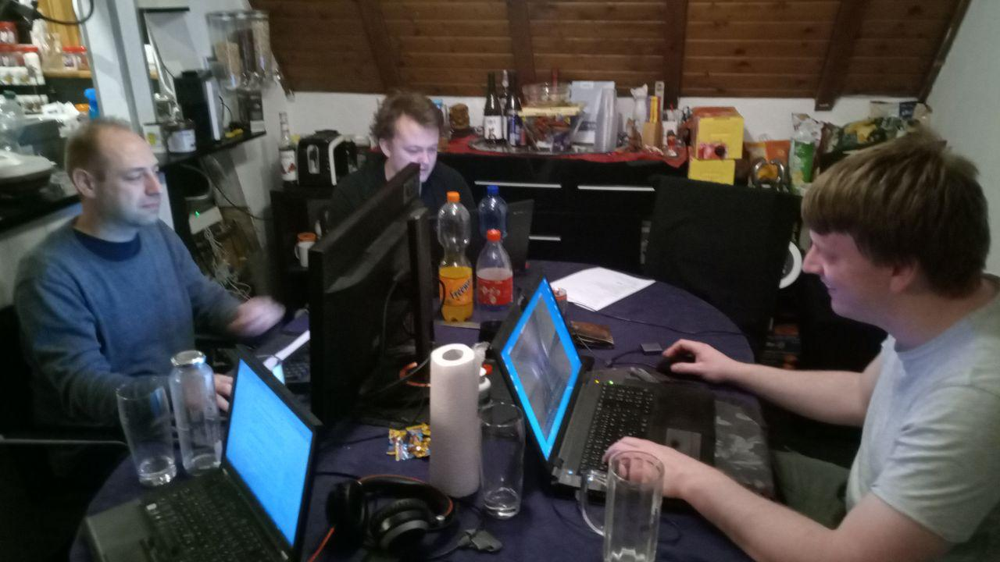

Hello fellow hackers!

This years last hackathon was very productive and we slowly see things getting shaped.

Misan hosted the second time in his private home and we had some great time preparing, eating food and hacking inbetween.

Lastly, we had a great time enjoying some Glühwein in the christmas market that happened right in front of the house:

We settled for an interface to interact with the game between consumers.
The good thing in such a decoupled environment is, that everyone can pretty much work independently. As long as we have one schema and interface we can rely on.

We decided to go with GraphQL - an exciting new technology. Since it speaks JSON, anyone can easily consume it. Webdevelopers especially.

Right now we have these modules in the work:

### Entity System

This is the central reactive data storage we build to define behavior and data of entities. Pretty much anything can be an entity.
* Geometry
* Lights
* Keybinds
* Players
* Cameras
* [the list goes on](https://hackmd.io/6glkB2UoQsKcWfVhGasVoA#List-of-Entity-Type-Systems)

The consumers just have to subscribe to changes and do their rendering.
Hanack and a-teammate put a lot of effort into making the Entity System consumable via GraphQL.

Repository: [https://github.com/inexorgame/entity-system](https://github.com/inexorgame/entity-system)

### User Interface - Developer Tools

Movabo created some developer console-like tooling to query the entity system. Here is what it looks like

Repository: [https://github.com/inexorgame/ui-client-interface](https://github.com/inexorgame/ui-client-interface)

### User Interface - Main Menu and Assets

Misan started working on the general user interface parts that are somewhat detached from the rest of the system right now.

Currently in progress is a first draft of a main menu.

We tried to come up with a common design. Let's see if it works out.

Another example menu is the assets manager for textures, models, etc.
In the future you will be able to interactively filter by category and whatever meta data the community has attached to these contents.

<video src="./assets-category-filter.mp4" class="w-full" controls />

Repository: [https://github.com/inexorgame/ui-client-interface](https://github.com/inexorgame/ui-client-interface)

### Cube2 Map Importer

Hanni started to create a tool that is able to import maps from the well known open source game Sauerbraten into the entity system.

It now serves as a standalone tool to read maps in clear text.
Later on, it will be serialized into the entity system again.

Repository: [https://github.com/inexorgame/cube2-map-importer](https://github.com/inexorgame/cube2-map-importer)

### Content

Meanwhile, @Nothing has worked on recreating some models and experiments with new software like Substance Designer, Substance Painter. etc.

### That's it!

Wanna participate in Inexor? Have ideas?

Join us on [Telegram](https://t.me/inexor) - we are always looking forward for your input :)