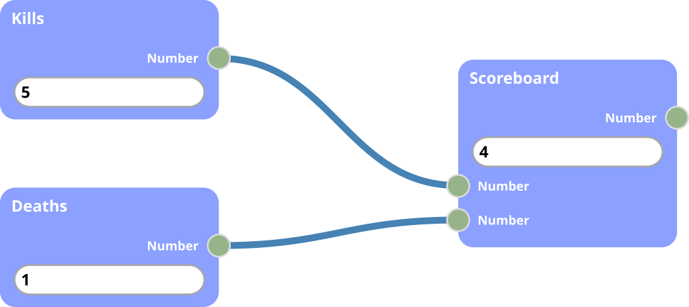
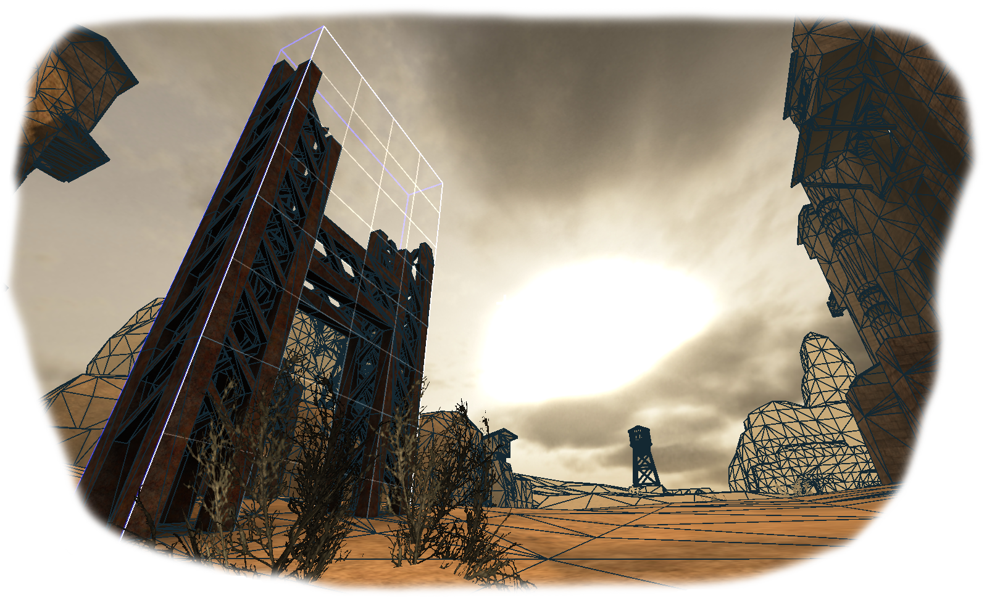
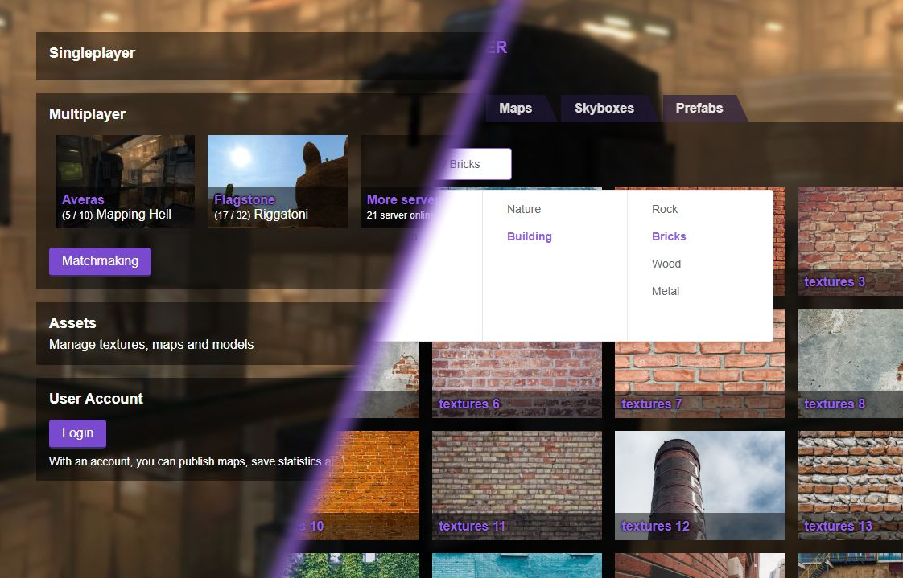

    

        <SiteLogo />
        

            

                

                    <h3 class="text-center bg-black-faded py-2">News</h3>
                    

                        <h4 class="text-lg">
                            <router-link :to="post.path">
                                {{post.title}}
                            </router-link>
                        </h4>
                        {{post.frontmatter.date | formatDate}}
                    

                    <router-link to="/blog/" class="px-4">
                        Browse all {{posts.length}} blogposts
                    </router-link>
                

            

            

                

                    <h3 class="text-center bg-black-faded py-2">Docs</h3>
                    

                        <ul>
                            <li v-for="doc in docs">
                                <router-link :to="doc.link">
                                    {{doc.text}}
                                </router-link>
                            </li>
                        </ul>
                    

                

            

        

    

## Vulkan API tech demo

[Get our latest tech demo here!](https://github.com/inexorgame/vulkan-renderer/releases/tag/0.1.0-alpha-3)

Join our discord! [https://discord.gg/acUW8k7](https://discord.gg/acUW8k7)

## What is Inexor?
* Inexor will be a new first person shooter game which is based on a new octree-based game engine.
* Inexor focuses on classic gameplay as we've seen in Cube2 or the Quake series.
* Inexor will be written from ground up new in modern C++17.
* You can contribute anything you want: code, content, ideas..
* Inexor and all its content is 100% open source!

## What is the point of Inexor?
* We want to create a game which has classic gameplay but a very powerful embedded world editor.
* Inexor is a sandbox: There is no separation between engine editor and the game itself. Creating the game is part of the game.
* People's ideas for the game will no longer be limited by the underlying engine technology.
* Players can express their map or game mode ideas without any restrictions by us, using a visual scripting enviroment - even collectively in multiplayer.

## Who is behind Inexor?
* A collective of game programmers, artists, or people who are very passionate about gaming.
* There is no strict hierarchy behind this organisation.
* Everybody is welcome.
* Inexor will always try to bring people together.

    <h2 class="my-8 inline-block">Features</h2>
    

        <FadeInContent class="w-1/2">
            
        </FadeInContent>
        

            

                <h3 class="text-center bg-black-faded py-2">Visual Scripting</h3>
                

                    Design and create any game mode you can imagine.
                    Connect interactive components together to open doors in a dungeon crawler.
                    Equip a fort with automatic weapons to conquer with your friends.
                

                <router-link to="/wiki/features/entity-system/Visual-Scriptings.html" class="mx-4 button">Learn more</router-link>
            

        

    

    

        

            

                <h3 class="text-center bg-black-faded py-2">Ingame Editor</h3>
                

                    Craft all the contents needed for maps cooperatively, ingame.
                    Quickly repeat a set of pillars with the prefab editors, or layer your buildings on top of terrain.
                    With the ingame editor, building the game becomes part of the game.
                

                <router-link to="/wiki/features/content-editor/" class="mx-4 button">Learn more</router-link>
            

        

        <FadeInContent class="w-1/2">
            
        </FadeInContent>
    

    

        <FadeInContent class="w-1/2">
            
        </FadeInContent>
        

            

                <h3 class="text-center bg-black-faded py-2">Community Platform</h3>
                

                    Share content with everyone and re-use what others have made for your own worlds.
                    Browse content, artists or join a server to exchange new ideas in real time.
                

                <router-link to="/wiki/features/community/" class="mx-4 button">Learn more</router-link>
            

        

    

## How to contribute?
* Currently, we are in the process of writing the game engine.
* Programmers and testers are most needed right now.
* Artists and mappers are also welcome, but the time for creating maps has not come yet.

## Why develop a new game engine?
* We need a new octree-based game engine which is based on a task-based, multithreaded engine.
* Vulkan API is a new graphics API which allows us to gain better performance.

## How to get into contact?
* Please join our discord server! Just search for `inexor`.
* You can also write us: `info@inexor.org`.

## When will Inexor be playable?
* This depends on the speed of our progress.
* We can't forsee this yet.

## I found a bug in Inexor, what now?
* Open a [ticket](https://github.com/inexorgame/vulkan-renderer).

## Which systems will be supported?
* This release contains files for Windows only.
* We are working to get the [Linux build](https://github.com/inexorgame/vulkan-renderer/issues/19) working as fast as possible.
* We might support Android in the future.
* Because Apple decided not to support Vulkan API natively, we will not Mac OS.
We are not planing on using [moltenVK](https://github.com/KhronosGroup/MoltenVK) to get our projects running on Mac OS either.

## Is Inexor a fork of Cube2?
* No, Inexor is a new code base which has no dependencies in cube-engine.

## What will be different in Inexor compared with Cube2?
* It is too early to answer this question as we're in the process of writing the game engine first.
* The answer to this question will very much depend on your input.

## Will you use any code parts from cube-engine?
* No. Cube engine is single threaded. This was fine back in the day of its creation but nowadays it acts as a bottleneck for the gpu.

## Will Inexor be compatible with Cube2 or other games?
* No, because Inexor's objective is different.
* We don't want to limit ourselves by supporting old technology?

## Can I import my maps from Cube2 into Inexor?
* We are working on a [map converter](https://github.com/inexorgame/cube2-map-importer).
* It is not ready yet.

## What's next?
* **v0.1-alpha.3**: May 10th, 2020.

    <router-link to="wiki/Get-Involved.html" class="button my-4">Get involved 👋</router-link>

