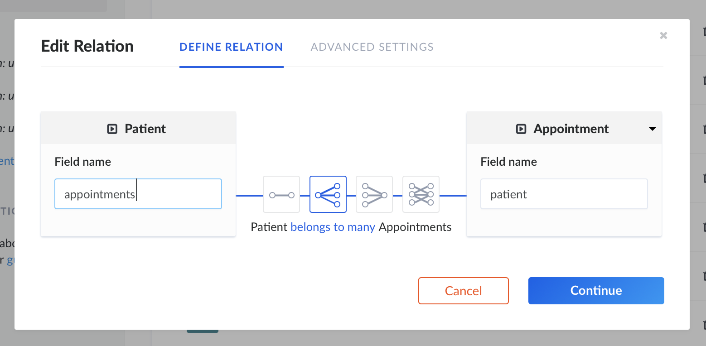

# Implementation Server-side

## Introduction

Contents are hosted on our community hub.
Proposed urls for that are `api.inexor.org` or `community.inexor.org`.

The content distribution service should be dezentralized in the future, to match with the ideas of [Distributed Network](../distributed-network/).
For now, we have a centralized approach, which can be further broken apart in the future. Maybe in a similar fashion how torrents work.

## Current Implementation

Under the hood we use [Strapi](https://strapi.io) as content management framework. This allows us to quickly organize schemas and extend the API. API endpoints are generated by strapi and can quickly be expanded on demand. Mysql, Postgres, Mongodb or SQLite can be used as database (the framework is db agnostic). For now we decide to go with mongoDB, as it comes with the best feature parity for strapi. Switching to MySQL (as we have most experience with that) is thinkable though.

Relationships are easily maintainable via strapi:




## Client

Strapi comes with a HTTP Restful interface and a GraphQL interface.

There only exists a [JavaScript client](https://strapi.github.io/strapi-sdk-javascript/classes/strapi.html) offered by strapi. However since everything is based on HTTP, for our C++ side we could use curl or whatever client we are comfortable using.

Read-only for public access is enabled by default, only logged in users are allowed to `POST` and `PUT` their own content. `PUT` for contents where they are registered as co-authors is also allowed.

More details on how to search for items of an API/table/list is documented in [Strapis filter documentation](https://strapi.io/documentation/3.x.x/guides/filters.html#available-operators). This way, we could query for e.g. `GET` `community.inexor.org/contents?starred=true` to retrieve all starred content for initial setup on game start.

## Schema

This is our current schema implementation with fields and descriptions.

* Comment
* Content
* Gamemode
* License
* Server
* Team
* User

There are more strapi-internal models like groups and permissions, to assign public/user/admin permissions.

### Comment

We may want to support nested comments, in this case we need to define parent/children.

#### Fields

``` json
{
    "text": {
        "default": "",
        "type": "text"
    },
    "content": {
        "model": "content",
        "via": "comments"
    }
}
```

### Content

#### Packaging

The most important field here is `package` which contains the file, which is important for client-side use e.g. in the Entity-System.
There are JSON based contents (prefab, entity, map) and binary based contents (model, texture, sound)
Collections are a special type of content. It is yet to decide how exactly we package contents.

**Option A:** Use dependencies as field to recursively resolve all required sub-packages and have the `package` field only contain the original content + references to other contents. This results in more client-work, (a complex package manager to retrieve and resolve dependencies is required), more HTTP overhead for recursive resolving but less harddisk storage usage. Using a package manager, we could also easily pin-point

**Option B:** Have package include the entire required original content of all sub-dependencies when being uploaded. Which results in less client-work, less HTTP overhead, but more harddisk storage usage.

#### Current problems with schema

This schema is likely to change, because dependencies are currently linked as contents. This makes it impossible to implement a [version control](../Version-Control-System.md) for every kind of content. Users should be able to define the versions of their dependencies. This version control has to work both offline and online (push/pull)

Secondly, the gamemode is expected to be both a content (entity) but also be able to work as its own content node, to be used for relationship analysis (who is playing what gamemode on which server?)

This is a preliminary preview of the schema:

#### Fields

``` json
{
    "title": {
        "type": "string"
    },
    "description": {
        "type": "text"
    },
    "authors": {
        "collection": "user",
        "dominant": true,
        "via": "contents",
        "plugin": "users-permissions"
    },
    "package": {
        "collection": "file",
        "via": "related",
        "plugin": "upload",
        "required": false
    },
    "license": {
        "model": "license",
        "via": "contents"
    },
    "rating": {
        "type": "float"
    },
    "gamemodes": {
        "collection": "gamemode",
        "via": "contents",
        "dominant": true
    },
    "comments": {
        "collection": "comment",
        "via": "content"
    },
    "type": {
        "default": "",
        "type": "enumeration",
        "enum": [
            "collection",
            "map",
            "prefab",
            "model",
            "texture",
            "sound",
            "entity"
        ]
    },
    "dependencies": {
        "collection": "content",
        "via": "dependents",
        "dominant": true
    },
    "dependents": {
        "collection": "content",
        "via": "dependencies"
    },
    "teamHome": {
        "model": "team",
        "via": "homeMap"
    },
    "servers": {
        "collection": "server",
        "via": "map"
    }
}
```


### Gamemode

#### Fields
``` json
{
    "name": {
        "default": "",
        "type": "string"
    },
    "contents": {
        "collection": "content",
        "via": "gamemodes"
    },
    "servers": {
        "collection": "server",
        "via": "gamemode"
    }
}
```


### License

#### Fields

``` json
{
    "name": {
        "default": "",
        "type": "string"
    },
    "contents": {
        "collection": "content",
        "via": "license"
    }
}
```


### Server

#### Fields

``` json
{
    "name": {
        "default": "",
        "type": "string"
    },
    "creator": {
        "model": "user",
        "via": "serversCreated",
        "plugin": "users-permissions"
    },
    "players": {
        "collection": "user",
        "dominant": true,
        "via": "serversPlaying",
        "plugin": "users-permissions"
    },
    "maxPlayers": {
        "default": 12,
        "max": 1024,
        "min": 1,
        "type": "integer",
        "required": true
    },
    "gamemode": {
        "model": "gamemode",
        "via": "servers"
    },
    "map": {
        "model": "content",
        "via": "servers"
    }
}
```

### Team

Comparable to usergroup or clan as a different name. Allows the user to organize themselves for playing and mapping.

#### Fields

``` json
{
    "name": {
        "default": "",
        "type": "string"
    },
    "homeMap": {
        "model": "content",
        "via": "teamHome"
    },
    "description": {
        "default": "",
        "type": "text"
    },
    "tag": {
        "default": "",
        "type": "string"
    },
    "founder": {
        "model": "user",
        "via": "teamsFounded",
        "plugin": "users-permissions"
    },
    "members": {
        "collection": "user",
        "dominant": true,
        "via": "teams",
        "plugin": "users-permissions"
    }
}
```

### User

Instead of maintaining an configfile of user-settings, common things like selected playermodel can be saved to the online profile.

#### Fields

``` json
{
    "username": {
        "type": "string",
        "minLength": 3,
        "unique": true,
        "configurable": false,
        "required": true
    },
    "email": {
        "type": "email",
        "minLength": 6,
        "configurable": false,
        "required": true
    },
    "password": {
        "type": "password",
        "minLength": 6,
        "configurable": false,
        "private": true
    },
    "confirmed": {
        "type": "boolean",
        "default": false,
        "configurable": false
    },
    "blocked": {
        "type": "boolean",
        "default": false,
        "configurable": false
    },
    "role": {
        "model": "role",
        "via": "users",
        "plugin": "users-permissions",
        "configurable": false
    },
    "teamsFounded": {
        "collection": "team",
        "via": "founder"
    },
    "teams": {
        "collection": "team",
        "via": "members"
    },
    "contents": {
        "collection": "content",
        "via": "authors"
    },
    "comments": {
        "collection": "comment",
        "via": "author"
    },
    "avatar": {
        "model": "file",
        "via": "related",
        "plugin": "upload",
        "required": false
    },
    "model": {
        "model": "content"
    }
}
```
