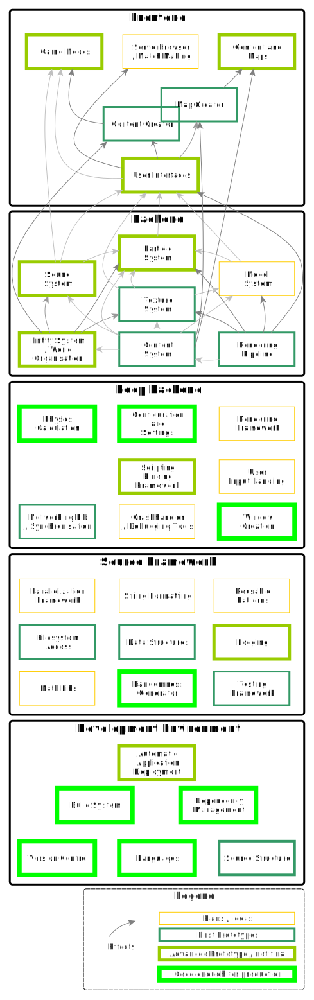

# Overview

The goal of this project is to create a standalone fork of [Cube 2: Sauerbraten](http://sauerbraten.org/), establishing a bigger game audience and keeping the game alive for the future by enhancing and modernizing it.

## Objectives

* Keep Sauerbraten's spirit alive
* Make implementing community ideas easy, by creating creators
* Increase the old audience
* Make it 100% [open source software](https://creativecommons.org/about/program-areas/technology/technology-resources/software/) and free of restricting licenses

## The Vision

There are opportunities only an open-source game can offer.  
There are paths only those can walk who do not fear theft of their work.  

We want to create a game which allows people to create the game.  
To have fun learning continuously more stuff as they dig deeper into making it their own.  
To develop the right mindset to attack challenging problems.  
To work and create cooperatively in a team rather than on your own.

Those who see it as enhancement when someone else starts working with their creation will find their place in this project.  
Inexor will always try to bring people together.

Want to join us?

[Get involved](./Get-Involved.md)<!-- {.button} -->

## The Background

We did not start from scratch. We derived from the famous open-source game [Cube2: Sauerbraten](http://sauerbraten.org/), which itself is a great open source project.
It's unique gameplay, friendly and creative community, elaborated engine features, ingame map editor and much more gave us a great head-start. One advantage is that we always have something to play with, even in times we consider ourselves unfinished. 

The design ideas of Sauerbraten will live on in a new engine. We find the ideas of Sauerbraten worthy enough to be sustained in a new game. Everyone who really cared about the game knew that something had to follow it up.

[See features we want to build](./features/)<!-- {.button} -->

## The Connection

The structure of Inexor can be displayed as follows:

_**Most widely effecting parts on the bottom, most visible parts at the top**_

Those bottom systems determine the major direction, while the higher parts have to act in the frame of the lower choices.

Otherwise the upper parts are those which predominantly influence the finished game and which the normal player will remember.

We have the time to iteratively create systems, and the freedom to improve their maintainability and usability until they are considered to be done.

Developing software always includes thinking about the level of abstraction you want to keep in each layer.  
So how do we define the cuts? How to cut the system into logical chunks?

Below you can find everything you need to get started with development
### Development

* [Build](./development/Build.md)
* [How to contribute Code](./development/How-To-Contribute-Code.md)
* [How To Debug](./development/How-To-Debug.md)
* [FAQ](./Frequently-Asked-Questions.md)
